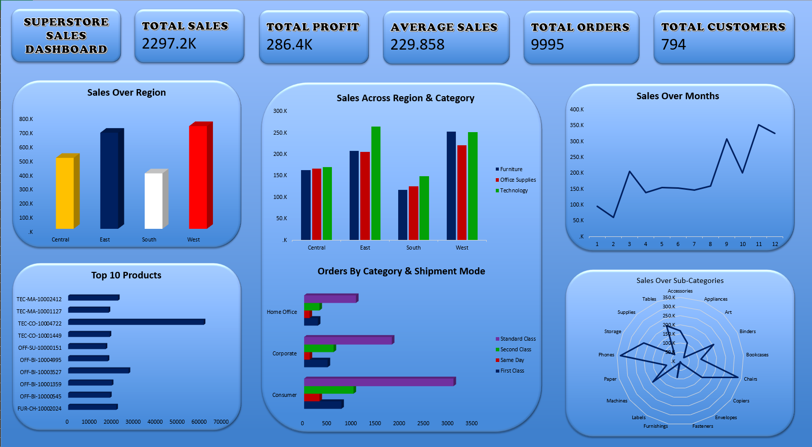

# 🛒 Superstore Sales — EDA & Dashboard

An end-to-end Exploratory Data Analysis (EDA) project on the classic **Sample Superstore** retail dataset (2014–2017), covering data cleaning, feature engineering, pivot-table analysis, and an interactive Excel dashboard.

---

## 🎯 Project Overview

This project takes a raw, real-world-style retail orders dataset, cleans it, engineers useful analytical fields (order timing, shipping duration, sales/customer segmentation flags), and builds a single-page Excel dashboard summarizing sales, profit, and operational performance across regions, categories, and time.

## 🧰 Tools Used

- **Microsoft Excel** — data cleaning, pivot tables, pivot charts, dashboard design

## 📊 Dashboard Highlights

| Metric | Value |
|---|---|
| Total Sales | $2,297,200.86 |
| Total Profit | $286,397.02 |
| Average Sale Value | $229.86 |
| Total Orders | 5,009 unique orders (9,994 line items) |
| Total Customers | 793 |

See **[DOCUMENTATION.md](DOCUMENTATION.md#f-insights)** for the full breakdown and business insights.

## 👤 Author

Aparijit

